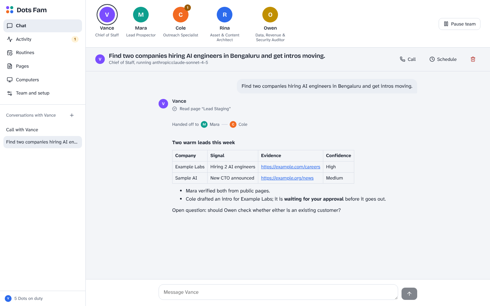
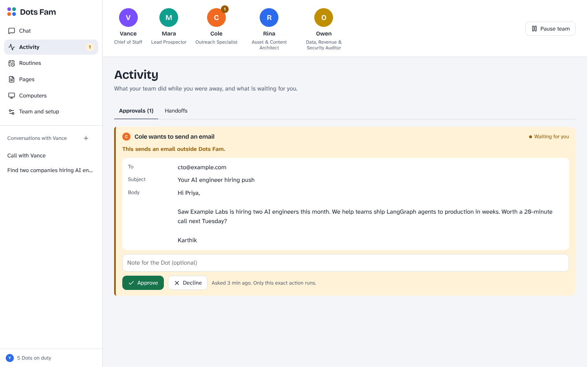
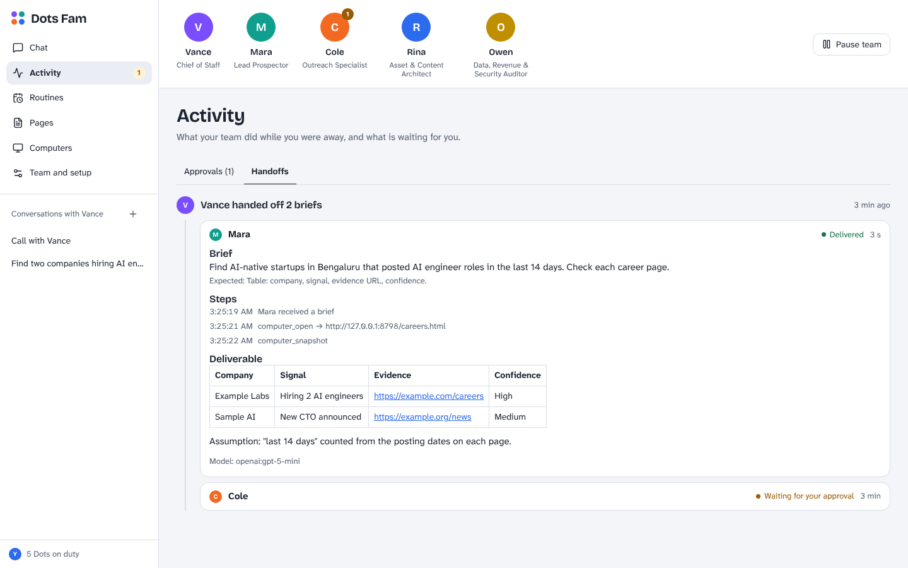
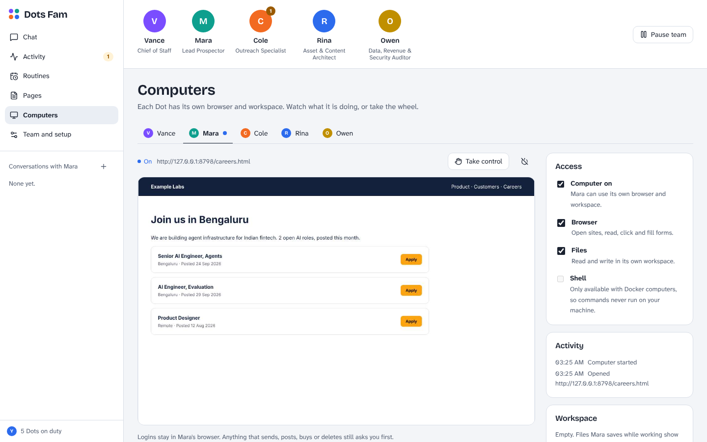
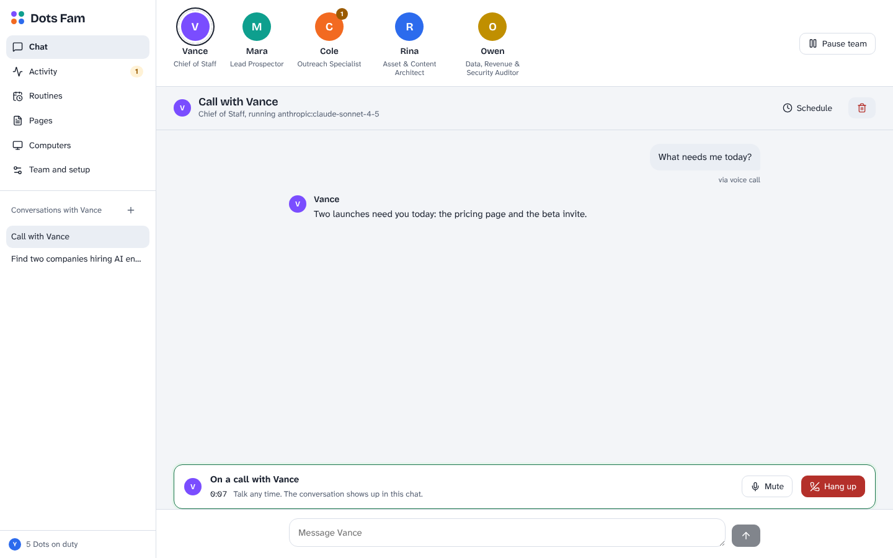
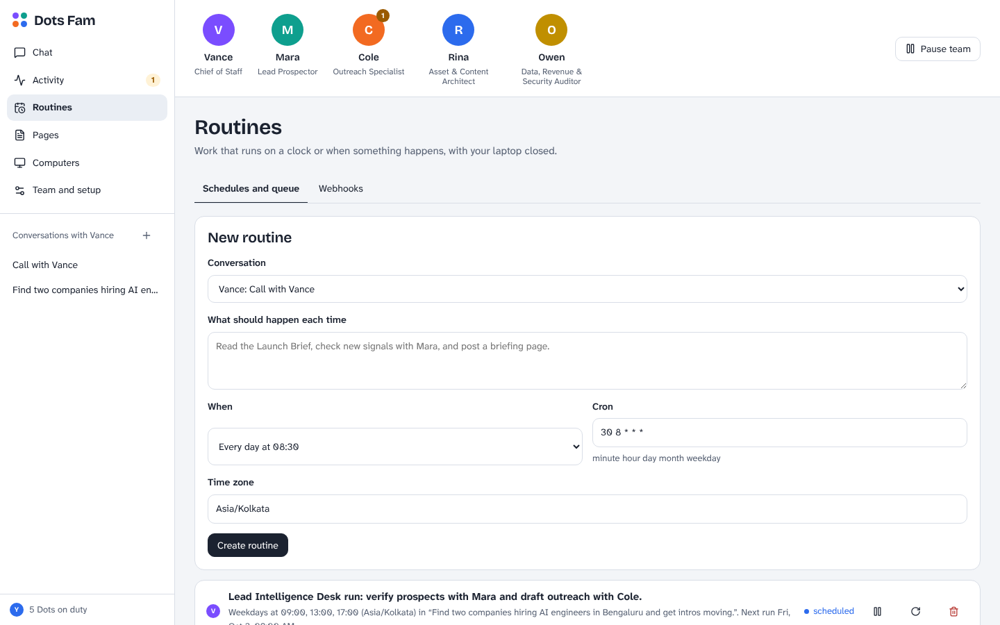
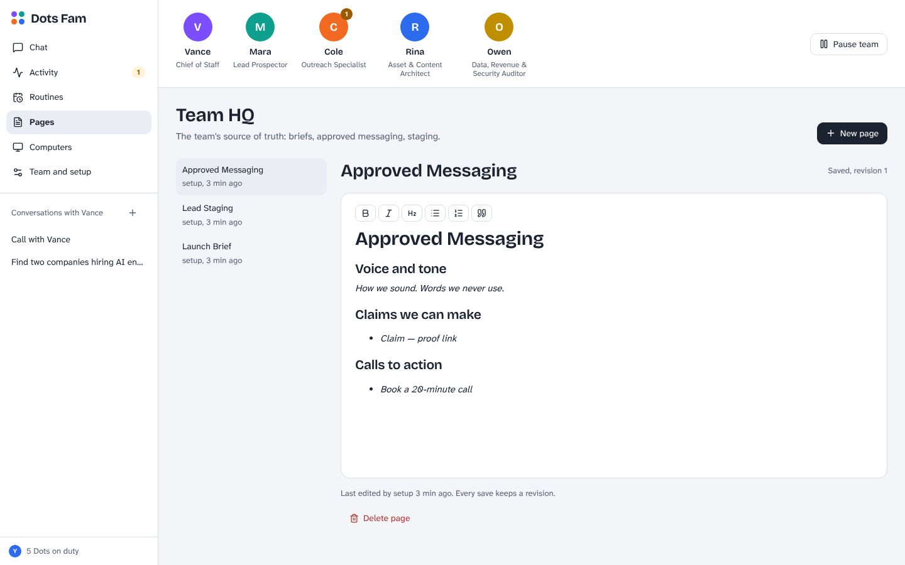

# Dots Fam

**An always-on AI team you run yourself.** You talk to a Chief of Staff. It splits the work and hands it to specialists. Each one has its own model, its own browser and its own role. They keep working on schedules and webhooks while you are away, and they stop to ask you before anything that can't be undone.

Built from scratch on **LangGraph + FastAPI + React**. It works through chat, Slack and voice calls.



## What you get

| | |
| --- | --- |
| **A team, not a chatbot** | Vance (Chief of Staff) delegates to Mara (leads), Cole (outreach), Rina (content) and Owen (data and security). Role cards are the org chart: edit them, add Dots, give each its own model. |
| **Parallel, isolated handoffs** | Each specialist gets one self-contained brief in its own thread, runs in parallel, and reports back. Late results arrive as a team update in your conversation. |
| **The Reversibility Law** | Dots read, research and draft freely. Sending, posting, paying, deleting, pushing or submitting pauses for your approval: in the web app, with Slack buttons, or by saying "yes" on a call. Declines go back to the Dot so it can change course. |
| **Web research** | Every Dot can search the web, read and crawl pages, and get quick cited answers through [Exa](https://exa.ai). When a question needs current facts, the Dot searches, reads the best sources and answers with links. A per-task budget stops runaway searching. |
| **Routines and webhooks** | Cron schedules in your time zone ("weekdays at 9, 1 and 5") and signed webhooks (GitHub and Linear signatures verified, rate-limited, payload treated as untrusted). |
| **A computer per Dot** | A browser that remembers its logins, a workspace for files, and an optional shell inside the Dot's own Docker container. Watch the live screen, take control, hand it back. |
| **Pages** | Shared Markdown documents with revisions and conflict checks. Dots write briefs and staging tables here; you edit them in a rich editor. |
| **Slack** | Mention the app or DM it. Every Slack thread is one conversation, and `Mara: ...` talks to Mara directly. Routine results and approvals can go to a channel. |
| **Voice calls** | Call any Dot from the browser. Open models by default: Whisper to hear you, Kokoro to talk back, Smart Turn to know when you're done talking. |
| **Kill switches** | Pause the whole team, stop one run, stop one handoff, or switch a Dot between "ask before acting" and autonomous. |
| **Blueprints** | One click installs a working setup: Autonomous Launch Coordinator, Continuous Lead Intelligence Desk, 24/7 Security and Dependency Auditor, or Executive Meeting & Follow-Up Desk. Each comes with its routine and/or webhook. |

| Approvals | Handoffs | Computer |
| --- | --- | --- |
|  |  |  |

| Voice call | Routines and webhooks | Pages |
| --- | --- | --- |
|  |  |  |

## Quick start

You need Python 3.11+, Node 20+ and a key for at least one model provider (Anthropic, OpenAI or OpenRouter). Add an `EXA_API_KEY` (exa.ai) too if you want the Dots to search the web.

```bash
git clone https://github.com/tanuku-saikarthik/dots-fam.git && cd dots-fam
cp .env.example .env            # add your API keys; set DEFAULT_TIMEZONE

python -m venv .venv && . .venv/bin/activate
pip install -e backend          # or: uv venv && uv pip install -e backend

(cd frontend && npm install && npm run build)

dotsfam                         # → http://127.0.0.1:8787
```

The first start creates Team HQ: five Dots and three seed pages. Vance uses `DEFAULT_MODEL`, the specialists use `WORKER_MODEL`. If you only have one provider, point both at it, for example `anthropic:claude-sonnet-4-5` and `anthropic:claude-haiku-4-5`. Any Dot can switch models under **Team and setup**. Models are written as `provider:model`, and `openrouter:...` reaches hundreds more.

**Check web search.** With `EXA_API_KEY` in `.env`, run `python -m dotsfam.check web "who is hiring AI engineers in Bengaluru?"`. It does one search, one page read and one cited answer the way a Dot would, and prints the cost of each.

**Running it for real.** Bind to a public address only with `OWNER_TOKEN` set (the server refuses otherwise), put it behind HTTPS, and set `PUBLIC_URL` so webhook URLs are correct. State lives in `data/` (two SQLite files), so back that folder up.

**Developing.** Run `dotsfam` and `cd frontend && npm run dev`, then open http://localhost:5174. Vite proxies `/api` and `/hooks` to the backend.

## Turning on the extras

Each one is optional and off until you configure it.

### A computer for each Dot

```bash
pip install -e "backend[computer]"
docker build -f computer/Dockerfile -t dotsfam-computer:latest .
# .env: COMPUTER_DRIVER=docker
```

Then open **Computers** and switch one on for a Dot. Each Dot gets its own container (`dotsfam-computer-<id>`) and its own volume for files and browser profile. The container is published on `127.0.0.1` only and needs a per-Dot token. The shell is off until you turn it on, and commands that push, deploy, post or call `curl -X POST` still ask you first.

`COMPUTER_DRIVER=local` runs one headless Chromium per Dot on the host instead (`playwright install chromium` first). Use it for development only: there is no isolation, so the shell is always off.

### Slack

1. Create an app from [`docs/slack-app-manifest.yaml`](docs/slack-app-manifest.yaml) (api.slack.com/apps, then **From a manifest**).
2. Generate an app-level token with `connections:write` and install the app to your workspace.
3. Set `SLACK_BOT_TOKEN`, `SLACK_APP_TOKEN` and `SLACK_ALLOWED_USERS` (your member ID). Optionally set `SLACK_NOTIFY_CHANNEL` for routine results and approvals.
4. Run `pip install -e "backend[slack]"` and restart.

Socket Mode means no public URL is needed. Only allowed members can talk to the team or press Approve.

### Voice calls

```bash
pip install -e "backend[voice]"     # Pipecat with WebRTC, Silero, Whisper and Kokoro
```

Press **Call** in any conversation. Each thing you say shows up in the chat, and the Dot answers out loud. The first call downloads the models: Whisper Large V3 Turbo (about 1.6 GB) and Kokoro (about 350 MB). On a modest CPU, set `VOICE_WHISPER_MODEL=small` for faster replies.

- Browsers only allow the microphone on `https://` or `localhost`.
- To call across networks, set `VOICE_ICE_SERVERS`. A TURN server helps behind strict NATs.
- `VOICE_STACK=openai` swaps in OpenAI speech-to-text and text-to-speech. The Dot, its tools and its approvals stay the same.
- `VOICE_STACK=off` turns calls off.

| Piece | Default | License |
| --- | --- | --- |
| Call framework | [Pipecat](https://github.com/pipecat-ai/pipecat), peer-to-peer WebRTC | BSD-2 |
| Hearing | Whisper Large V3 Turbo via faster-whisper | MIT |
| Speaking | Kokoro-82M via kokoro-onnx | Apache-2.0 |
| Turn-taking | Silero VAD + Smart Turn v3 | MIT / BSD-2 |

## How it works

```
 Web app ─┐                        ┌─ one LangGraph graph per run:
 Slack  ──┼─ FastAPI ─ RunManager ─┤    agent → gate → tools → agent
 Voice  ──┘     │                  │    (the gate pauses with interrupt() for approvals)
                │                  └─ DelegationManager: parallel, isolated briefs
                ├─ Scheduler: cron routines, webhook fires, team follow-ups
                ├─ ComputerManager: one container per Dot (Playwright service inside)
                └─ SQLite: team, pages, tasks, approvals, events  +  LangGraph checkpoints
```

- **A Dot** is a row with a role card, a model, permissions and a color. Every run builds a small LangGraph state graph with that Dot's tools, and the conversation lives in a checkpointed thread.
- **The gate** looks at each tool call before it runs. Tools are marked as external (always ask) or carry a classifier: browser clicks are judged by the name of the button, shell commands by pattern. Anything that needs you is saved as an approval and the graph pauses with `interrupt()`. Your decision resumes exactly that step with `Command(resume=...)`, so nothing re-runs and nothing is skipped.
- **Delegation** creates an internal thread per specialist with only the brief. If a specialist needs approval, its card shows up in your conversation, in Slack or on the call. When the work lands, the Chief gets a follow-up turn to merge it.
- **Runs stream** to the browser over server-sent events: text as it is written, tool steps, handoffs and approvals.

## Security notes

- One owner per server. `OWNER_TOKEN` protects the API and UI; keep the server on localhost or behind HTTPS.
- When a step can't be checked (an element missing from the latest snapshot, a keyboard shortcut, Enter outside a search box), the Dot asks first. Before acting, the computer confirms that the element still matches the snapshot and that focus is where the classifier assumed.
- The browser classifier is a guardrail, not a sandbox. It catches the usual words ("Send", "Pay", "Delete", "Publish", "Submit" and similar). A site that labels its purchase button "Continue" will get past it. Keep important Dots on **Ask before acting**, give computers only the logins they need, and leave the shell off unless a Dot needs it.
- Web pages, files, Slack messages and webhook payloads are handed to Dots as untrusted data. Prompt injection is still a real risk with any agent, and the approval gate is your backstop.
- `read_web_page` resolves a host once, refuses private addresses, and connects to the IP it checked, so DNS rebinding can't point it at your network.
- Webhook secrets are per trigger and can be rotated. Each trigger is limited to 30 fires an hour.

## Honest limits

- Single owner. There are no multi-user accounts or roles yet.
- The Docker computer image and real Whisper downloads are not exercised in CI. Tests use the local driver with real Chromium, a real WebRTC call and stubbed Whisper weights. Kokoro speech was checked end to end by hand.
- Every routine run spends model tokens. Watch your schedules.
- Voice works best in English. Whisper and Kokoro support other languages through `VOICE_LANGUAGE`, but the turn detector is tuned for English.

## Development

```bash
pip install -e "backend[dev,computer,slack,voice]"
cd backend && pytest && ruff check . && ruff format --check .
cd ../frontend && npm run typecheck && npm run build
```

```
backend/dotsfam/   agent.py (graph + gate), runs.py, delegation.py, scheduler.py, webhooks.py
                   computers.py + computer_service.py + reversibility.py, slack.py, voice.py
                   api.py, db.py, team.py (roster, blueprints), tools/ (pages, web, team)
frontend/src/      views/ (Chat, Activity, Routines, Pages, Computers, Team), components/
computer/          Dockerfile for the per-Dot computer image
```

## Credits

Inspired by [monokern's post](https://x.com/monokern/status/2105277060478382207) on running an always-on agent team. Built with LangGraph, FastAPI, React, TipTap, Playwright and Pipecat, plus the open Whisper, Kokoro, Silero and Smart Turn models.

An earlier version built on CopilotKit's OpenDots lives on the [`opendots-version`](https://github.com/tanuku-saikarthik/dots-fam/tree/opendots-version) branch.

MIT License.
