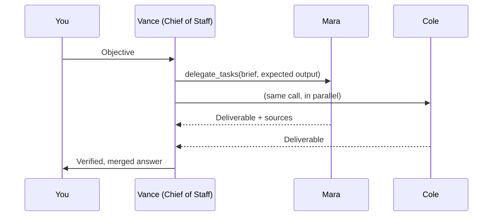

# An always-on team of Dots

This fork turns OpenDots from separate specialists into a team that keeps working with your laptop closed. It follows the "always-on AI coworkers" pattern: a Chief of Staff who delegates, specialists with their own computers, routines on a clock, event triggers, and a hard approval boundary around anything irreversible.

## What you get

| Piece                   | What it does                                                                                                                                                     |
| ----------------------- | ---------------------------------------------------------------------------------------------------------------------------------------------------------------- |
| **Model per Dot**       | Each Dot runs `provider:model` (OpenAI, Anthropic, or OpenRouter). Put a strong model on the Chief of Staff and a fast, cheap one on the specialists.            |
| **Chief of Staff**      | A Dot with **Chief of Staff** enabled gets `delegate_tasks`: up to five briefs at once, run in parallel, each on the specialist's own model, tools and computer. |
| **Isolated delegation** | A specialist sees only its brief, never your conversation. It returns a deliverable; the Chief verifies and merges.                                              |
| **Background handoffs** | Work that outlives the wait keeps running. Results arrive in the Chief's conversation as a follow-up turn.                                                       |
| **Reversibility Law**   | On by default. Dots read, research and draft freely. Sending, submitting, publishing, paying, deleting or pushing needs your approval first.                     |
| **Approvals inbox**     | Approve or decline in **Activity → Approvals**. The decision goes back to the conversation that asked.                                                           |
| **Routines**            | Cron schedules with a time zone (`30 8 * * *` in `Asia/Kolkata`). A failed run is logged and the routine keeps going.                                            |
| **Webhook triggers**    | `POST /hooks/:id` from GitHub, Linear, or any script starts a turn in a chosen conversation.                                                                     |
| **Team installer**      | One click creates Team HQ (Launch Brief, Approved Messaging, Lead Staging) and five Dots: Vance, Mara, Cole, Rina, Owen.                                         |
| **Blueprints**          | Launch Coordinator, Lead Intelligence Desk, Security & Dependency Auditor, Meeting Follow-Up Desk.                                                               |

## Set up

1. Add keys to `.env` (see `.env.example`):

   ```dotenv
   INTELLIGENCE_API_KEY=...            # CopilotKit Intelligence (stores conversations)
   OPENAI_API_KEY=...                  # any of these three providers
   ANTHROPIC_API_KEY=...
   OPENROUTER_API_KEY=...
   DEFAULT_MODEL=anthropic:claude-sonnet-4-5
   WORKER_MODEL=openai:gpt-5-mini
   DEFAULT_TIMEZONE=Asia/Kolkata
   ```

2. `npm run dev`, open the app, then **Team setup** in the sidebar → **Install the 5-Dot team**.
3. Fill in the Team HQ pages (Launch Brief, Approved Messaging, Lead Staging).
4. Install the blueprints you want. Copy each webhook secret when shown; it is displayed once.
5. For Dots that browse behind a login, start their computer ([Computer setup](COMPUTERS.md)), open **Take control**, sign in once, and release control. The session persists.

## The roster

| Dot   | Role                             | Default model   | Owns                                                         |
| ----- | -------------------------------- | --------------- | ------------------------------------------------------------ |
| Vance | Chief of Staff                   | `DEFAULT_MODEL` | Planning, delegation, review, the merged deliverable         |
| Mara  | Lead Prospector                  | `WORKER_MODEL`  | Company research, hiring and leadership signals              |
| Cole  | Outreach Specialist              | `WORKER_MODEL`  | Outreach drafts from verified leads (never sends unapproved) |
| Rina  | Asset & Content Architect        | `WORKER_MODEL`  | Landing copy, battlecards, briefs as pages                   |
| Owen  | Data, Revenue & Security Auditor | `WORKER_MODEL`  | Pipeline health, churn signals, dependency and secret audits |

Role cards are ordinary Dot instructions. Edit them freely: the Chief routes work from them.

## How delegation runs



- Workers run in-process on the server with their own tools. They do not open new Intelligence threads, so delegation does not spend your thread quota.
- `wait_seconds` (default 120) bounds how long the Chief waits in its turn. Unfinished work is delivered later as a `[Team update]` turn.
- Every handoff is recorded in **Activity → Team work**: brief, expected output, model, tool steps, deliverable or error. Stop running work there.
- Specialists cannot delegate further.

## The Reversibility Law

Enforced at the tool boundary for Dots with the setting on:

| Step                                  | Needs approval when…                                                                                                                |
| ------------------------------------- | ----------------------------------------------------------------------------------------------------------------------------------- |
| Browser click                         | the element's accessible name says send, submit, post, publish, pay, buy, order, delete, remove, confirm, merge, deploy, approve, … |
| Typing with submit, or pressing Enter | the field is not a search box                                                                                                       |
| Shell command                         | it pushes, publishes, deploys, mails, or sends a POST/PUT/PATCH/DELETE                                                              |

The Dot calls `request_approval` with the exact details and stops. When you approve, it gets the `approval_id` and may use it for up to five gated steps within two hours. A specialist's approval goes back through the Chief of Staff, who re-delegates with the id.

This is a classifier, not a sandbox. Browser elements are checked by their accessible names from the Dot's latest snapshot, and shell commands by pattern. Keep shell access off unless a Dot needs it, and give each Dot only the sign-ins it needs.

## Routines and triggers

- **Routines:** in a conversation, use the clock button → **At set times**. Presets cover daily 08:30, weekdays, and Mondays; any five-field cron works.
- **Triggers:** **Activity → Webhooks → New webhook trigger**. Authenticate with any of:
  - `Authorization: Bearer <secret>` or `X-OpenDots-Token: <secret>`
  - GitHub: set the webhook secret; OpenDots checks `X-Hub-Signature-256`
  - Linear: set the signing secret; OpenDots checks `Linear-Signature`
- Payloads are wrapped as untrusted data in the prompt and truncated at 8,000 characters. Each trigger fires at most 30 times an hour.
- Outside services must reach your server: deploy it (or use a tunnel) with `PUBLIC_URL`, `OWNER_TOKEN`, and HTTPS.

## Kill switches

| Control                  | Stops                                               |
| ------------------------ | --------------------------------------------------- |
| **Pause** (top bar)      | All chat turns, scheduled turns, and delegated work |
| **Activity → Team work** | One running handoff                                 |
| **Activity → Routines**  | A routine (Pause routine / Cancel)                  |
| **Activity → Webhooks**  | A trigger (toggle off or delete)                    |

Pausing a chat does not cancel routines. Check Routines and Webhooks when shutting a workflow down.

## Tuning

| Variable                 | Default | Meaning                                     |
| ------------------------ | ------- | ------------------------------------------- |
| `RUNNER_CONCURRENCY`     | 2       | Scheduled turns that may run at once        |
| `TASK_TIMEOUT_SECONDS`   | 420     | Limit for one scheduled turn                |
| `MAX_DELEGATED_WORKERS`  | 4       | Specialists working at once across the team |
| `WORKER_TIMEOUT_SECONDS` | 300     | Limit for one delegated brief               |

## Limits

- Live chat needs a CopilotKit Intelligence project. Its free tier keeps 3 days of history and 200 threads; delegation records stay in your SQLite file regardless.
- Slack is the only messaging connection. Teams, Google Workspace, and Microsoft 365 are not included.
- No hosted Codex equivalent: Owen audits with the shell in his own computer (`git`, `gh`, package audits).
- A restart marks in-flight delegated work as failed; the Chief is not re-run automatically.
